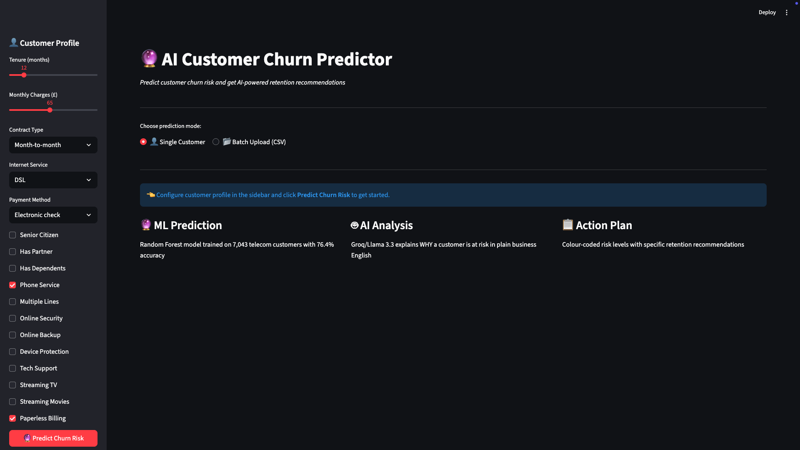
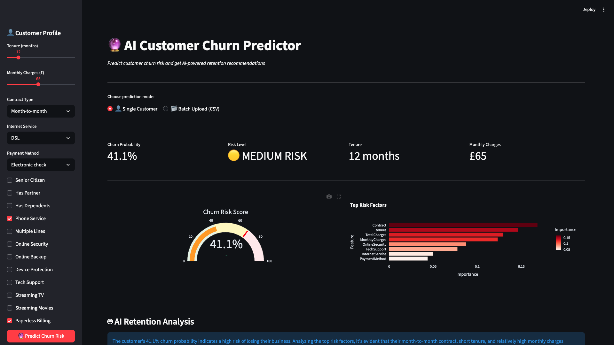
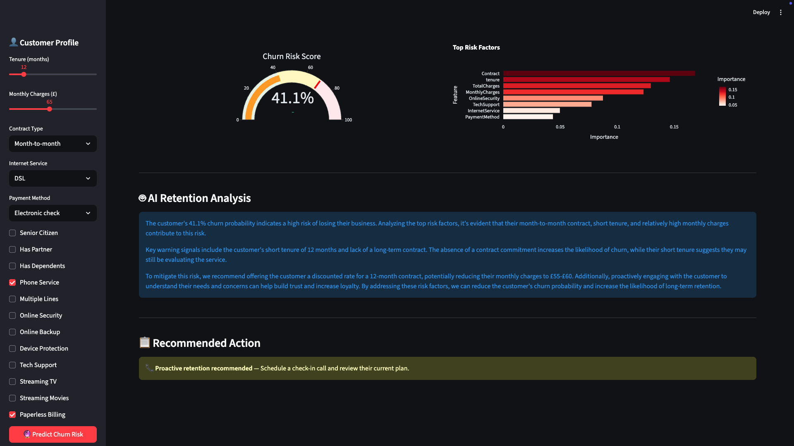
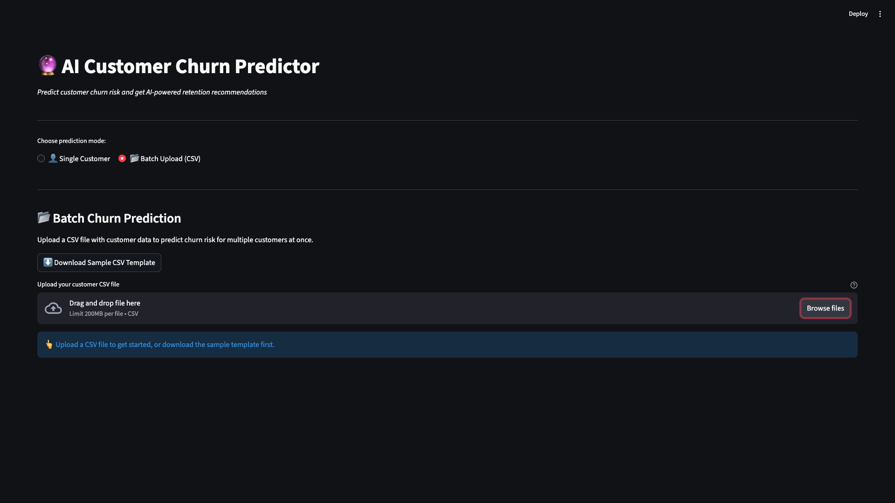
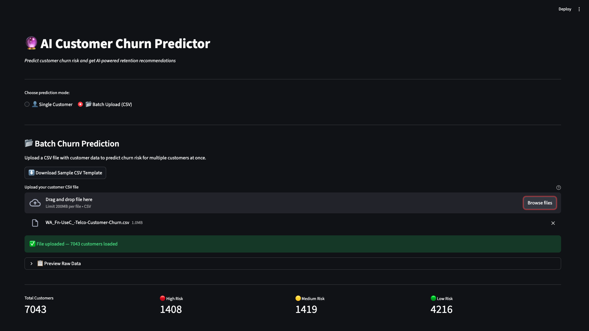
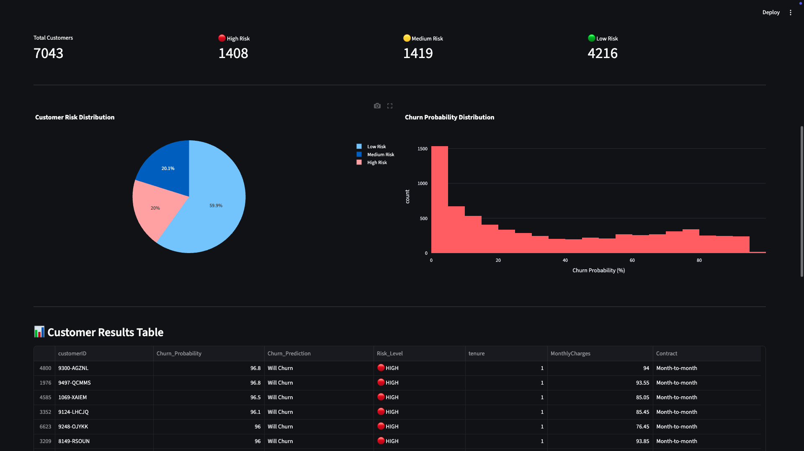
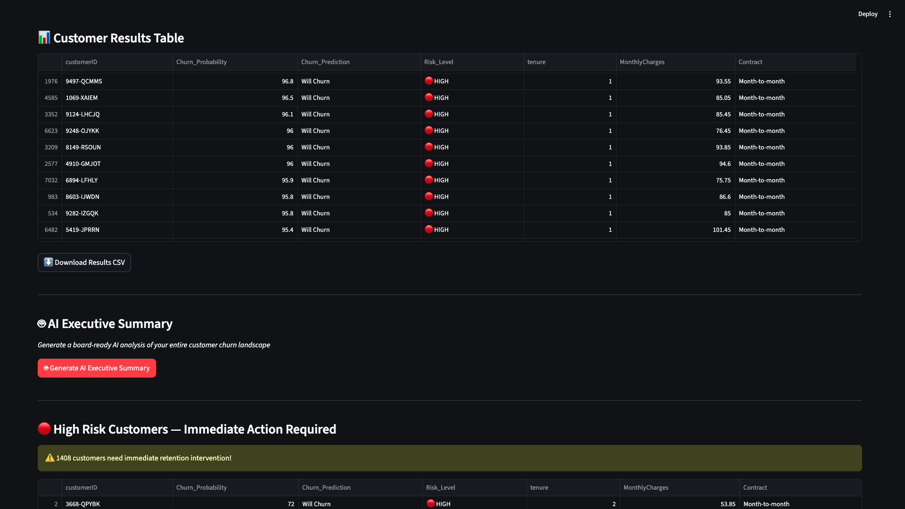
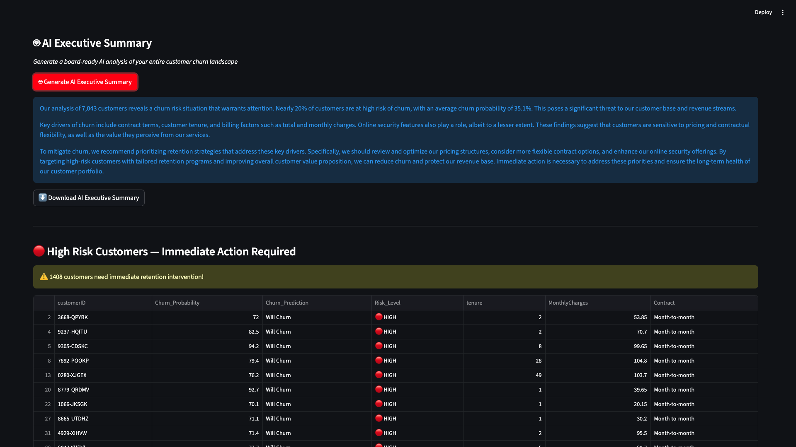

# 🔮 AI Customer Churn Predictor

An AI-powered customer churn prediction tool that uses Machine Learning and Groq/Llama 3.3 AI to predict which customers are at risk of leaving — and explains WHY in plain business English.

Built for customer retention teams, data analysts, and business leaders who need actionable insight fast.

**Live Demo:** [Coming Soon on Streamlit Cloud]

---

## 🚀 Key Features

- **🔮 Single Customer Prediction** — Input customer profile and get instant churn probability with gauge chart
- **📂 Batch CSV Upload** — Upload thousands of customers and predict churn risk for all at once
- **🤖 AI Retention Analysis** — Groq/Llama 3.3 explains WHY a customer is at risk in plain English
- **📊 AI Executive Summary** — Board-ready AI analysis of your entire customer base in one click
- **🔴 Risk Segmentation** — Automatic High / Medium / Low risk classification with colour coding
- **⬇️ Downloadable Results** — Export predictions as CSV and AI summary as text file

---

## 📸 Screenshots

### 🔮 Landing Page


### 📊 Single Customer Prediction


### 🤖 AI Retention Analysis


### 📂 Batch Upload Mode


### 📈 Batch Summary — 7,043 Customers Analysed


### 📊 Risk Distribution & Customer Results Table


### 🤖 AI Executive Summary Button


### 📋 Board-Ready AI Executive Report


---

## 🛠️ Tech Stack

| Tool | Purpose |
|------|---------|
| Python | Core programming language |
| Streamlit | Web application framework |
| Scikit-learn | Random Forest ML model |
| Groq / Llama 3.3 70B | AI insight generation |
| Pandas | Data manipulation |
| Plotly | Interactive visualisations |
| Joblib | Model serialisation |

---

## 🧠 How It Works

### Single Customer Mode
1. Configure customer profile in the sidebar
2. Click **Predict Churn Risk**
3. ML model returns churn probability + risk level
4. Groq/Llama 3.3 AI writes plain-English retention analysis
5. Recommended action displayed with colour-coded urgency

### Batch Mode
1. Upload any CSV file with customer data
2. Model predicts churn probability for all customers instantly
3. Summary metrics — High / Medium / Low risk counts
4. Customer results table sorted by highest risk first
5. Click **Generate AI Executive Summary** for board-ready analysis
6. Download results as CSV or AI summary as text

---

## 📊 Model Performance

| Metric | Score |
|--------|-------|
| Algorithm | Random Forest Classifier |
| Training Dataset | IBM Telco Customer Churn (7,043 customers) |
| Accuracy | 76.4% |
| Precision (Stay) | 87% |
| Recall (Churn) | 68% |
| Features | 19 customer attributes |

---

## ⚙️ Installation & Setup

```bash
# Clone the repository
git clone https://github.com/VinitBhalerao3012/churn-predictor.git
cd churn-predictor

# Create virtual environment
python3 -m venv venv
source venv/bin/activate

# Install dependencies
pip install -r requirements.txt

# Train the model
python3 train_model.py

# Add your Groq API key
mkdir .streamlit
echo 'GROQ_API_KEY = "your_key_here"' > .streamlit/secrets.toml

# Run the app
streamlit run app.py
```

---

## 🔑 API Keys Required

- **Groq API Key** — Free at [console.groq.com](https://console.groq.com)

---
## 📁 Project Structure

```
churn-predictor/
├── app.py
├── train_model.py
├── requirements.txt
├── README.md
├── .gitignore
├── models/
│   ├── churn_model.pkl
│   └── feature_names.pkl
├── data/
│   └── WA_Fn-UseC_-Telco-Customer-Churn.csv
└── assets/
    ├── churn-predictor-01-landing-page.png
    ├── churn-predictor-02-single-customer-prediction.png
    ├── churn-predictor-03-ai-retention-analysis.png
    ├── churn-predictor-04-batch-upload.png
    ├── churn-predictor-05-batch-summary-metrics.png
    ├── churn-predictor-06-charts-results-table.png
    ├── churn-predictor-07-ai-executive-summary-button.png
    └── churn-predictor-08-ai-executive-summary-output.png
```
## 👨‍💻 Author

**Vinit Bhalerao**
- 🔗 LinkedIn: [linkedin.com/in/bhalerao-vinit3013](https://linkedin.com/in/bhalerao-vinit3013)
- 🌐 Portfolio: [vinitbportfolio.netlify.app](https://vinitbportfolio.netlify.app)
- 💻 GitHub: [github.com/VinitBhalerao3012](https://github.com/VinitBhalerao3012)

---

## 📄 Dataset

IBM Telco Customer Churn Dataset — 7,043 customers, 21 features

Available on [Kaggle](https://www.kaggle.com/datasets/blastchar/telco-customer-churn)

---

## 📜 License

MIT License — feel free to use and adapt this project.